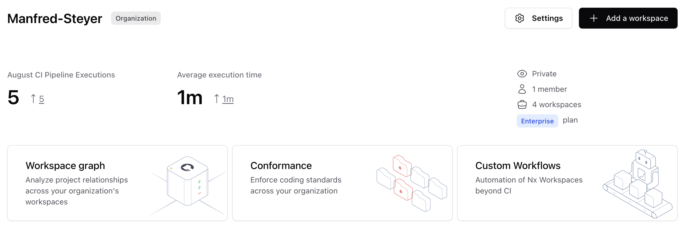
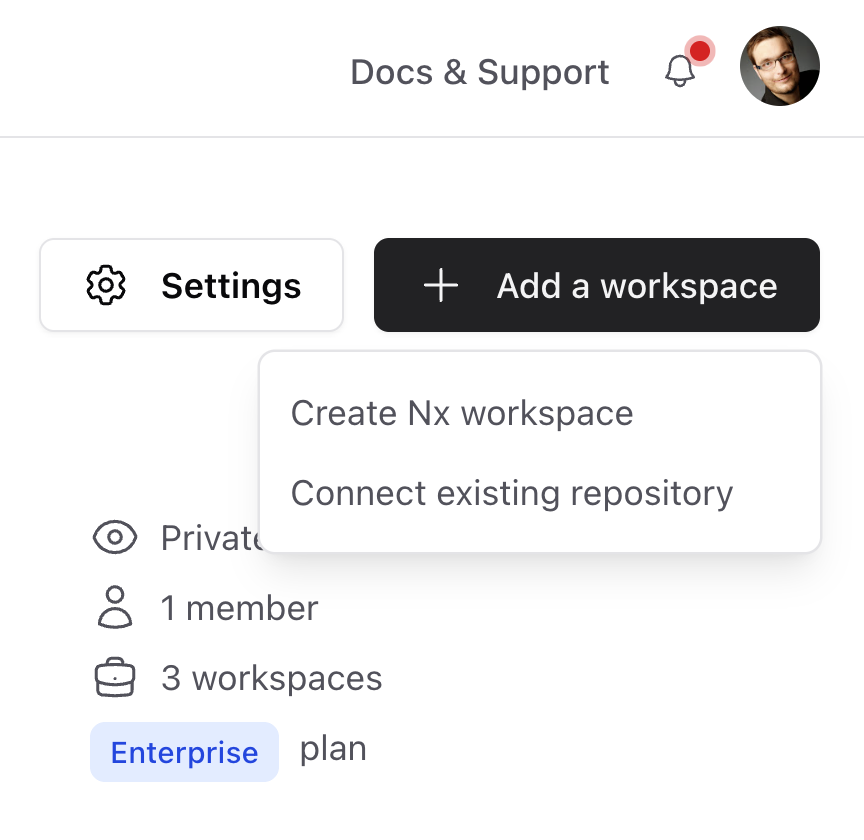
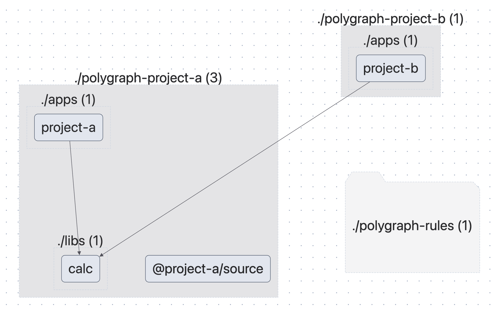
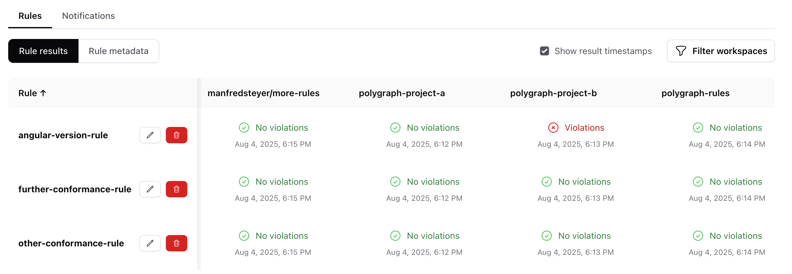
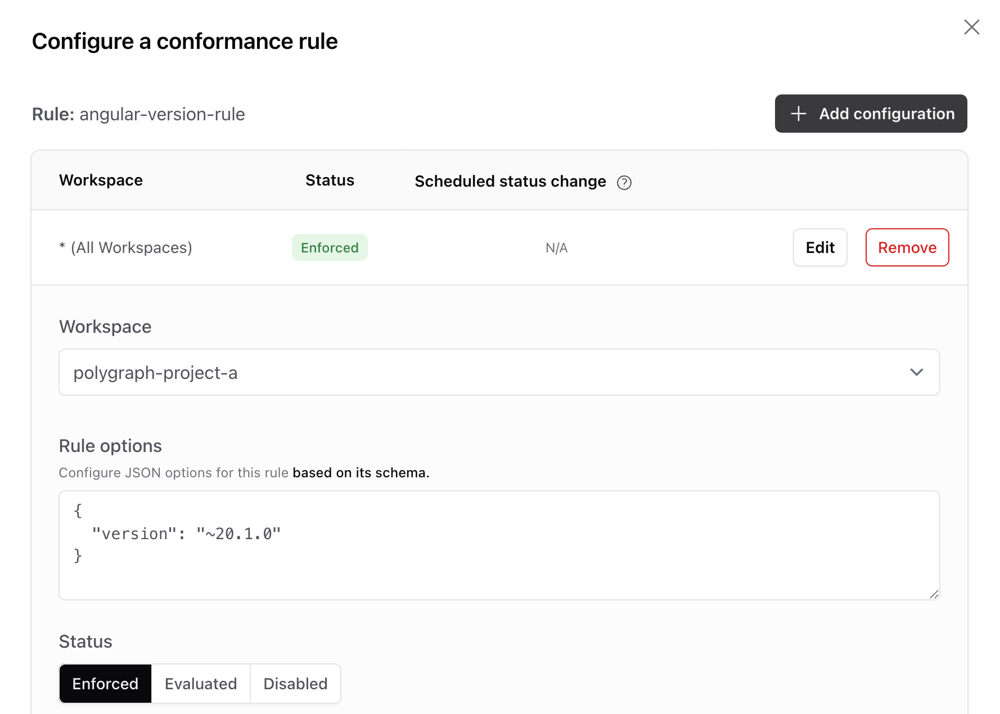
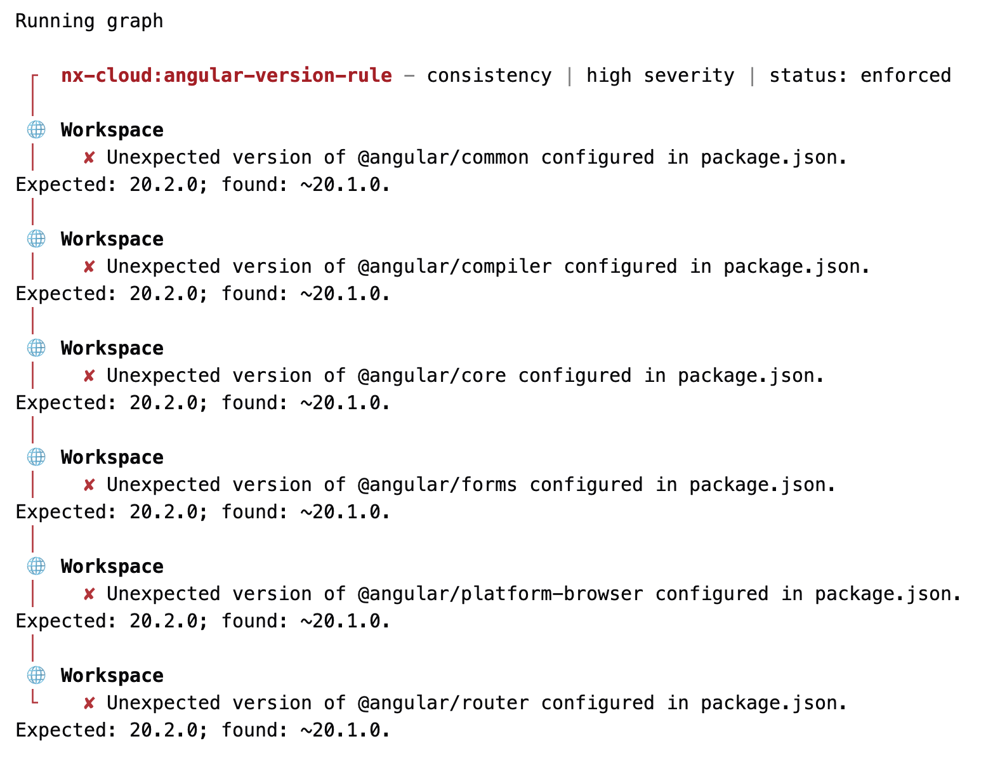
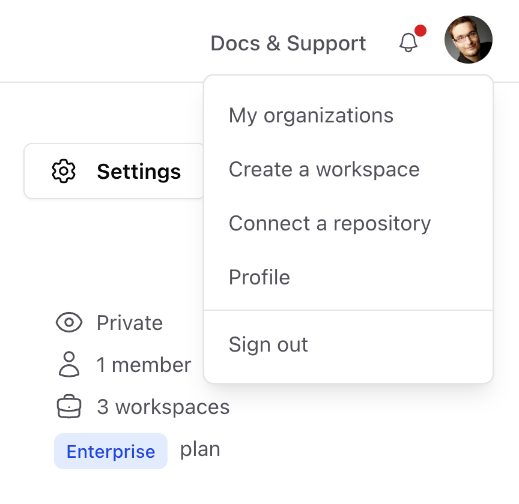

# Cross-Repo Environments with Nx Polygraph

While tech giants like Google and Facebook rely on monorepos, the reality for many companies is different: Business software is often developed in multiple project- or product-related repos. The relatively new [Nx Polygraph](https://nx.dev/blog/nx-cloud-introducing-polygraph) takes this into account by visualizing dependencies between repos and enforcing common policies.

In this article, I'll provide an overview of Polygraph and show how to develop a conformance rule that ensures the use of a specific Angular version across all repos. This check is especially essential for Micro Frontend projects, where you want to limit yourself to a single version for simplicity.

📂 [Source Code](https://github.com/manfredsteyer/polygraph-rules)

## Overview

Nx Polygraph is part of the [enterprise version of Nx Cloud](https://nx.dev/enterprise), the commercial extension of the popular open-source solution Nx for managing workspaces. Polygraph currently consists of three features, accessible directly from the Nx Cloud Dashboard:

- **Workspace Graph:** Visualizes dependencies between different repositories
- **Conformance:** Manages cross-repo conformance rules and informs about rule violations
- **Custom Workflows:** Manages batch runs that collect information about the workspace graph or check connected repos for compliance with conformance rules



To connect an Nx workspace to [Nx Cloud](https://nx.dev/nx-cloud), use the statement

```bash
npx nx connect
```

Alternatively, 

- you can specify that you want to use Nx Cloud when setting up your workspace with `create-nx-workspace`
- Go to https://cloud.nx.app/get-started/ to create a new workspace or connect an existing one

You can also generate a build script for the CI environment:

```bash
npx nx g ci-workflow
```

The workspace must then be checked into source code management (e.g. GitHub) and added to your organization in the Nx Cloud Portal:



## Workspace Graph

The workspace graph shows how the individual repos are connected. You can drill into the individual connected repos and see the applications and libraries managed there, as well as their dependencies. Dependencies between repos are npm packages that originate from one repo and are consumed by other repos.

For example, the following screenshot shows that _project-a_ and _project-b_ are located in different repos. However, the latter uses the _calc_ library from _project-a_, which was deployed via an npm registry:



Nx automatically collects the information for the Workspace Graph when Nx (e.g., _nx build_ or _nx run-many_) is executed as part of a build script in a CI environment, thus guaranteeing an **always up to date representation of your dependencies** even across repository boundaries.

## Conformance

The Conformance Dashboard provides information about whether the connected repos comply with the configured rules. The following image, for example, shows four projects in my demo organization and three conformance rules. Unfortunately, _project-b does_ not comply with the first one:



Under "Notifications", you can also enter email addresses for each project that should be notified in the event of a rule violation. The individual conformance rules are activated for individual or all projects and are configured accordingly. For example, the _angular-version-rule_, whose implementation I'll discuss below, receives the expected Angular version via its configuration. It checks the entries in the _package.json_ against this version:



On request, the Nx Cloud provides further details on failed conformance rules:



To ensure that Nx Cloud checks the rules in the configured projects, a custom workflow must be set up. The available screens can be accessed via the dashboard.

## Implementing a Conformance Rule

Nx gives us a lot of freedom when designing conformance rules, as they are technically JavaScript objects with metadata and an _implementation_ method. This method reads selected files from the project to analyze, checks them, and returns an array containing the detected rule violations.

The following statement generates an Nx project for Conformance Rules:

```bash
npx create-nx-workspace more-rules --preset=@nx/conformance
```

Such a project already contains an initial rule that can be used as a template for your own projects. Our conformance rule consists of a _schema.json_ file, which describes the rule's configuration options using a JSON schema, and an _index.ts_ file.

The _schema.json_ for the _angular-version-rule_ defines a property _version_ of type _string_:


```ts
{
  "$schema": "http://json-schema.org/schema",
  "$id": "angular-version-rule",
  "title": "options for example conformance-rule rule checking for a specific Angular version",
  "type": "object",
  "properties": {
    "version": {
      "type": "string"
    }
  },
  "required": ["version"],
  "additionalProperties": false
}
```

To use the stored configuration in the program code, a corresponding type is also required:

```ts
export type AngularVersionConformanceOptions = {
  version: string;
};
```

For simplicity, I created this type manually. For larger projects, it is recommended to generate such types. Npm packages such as _json-schema-to-typescript_ can be used for this purpose.

The _index.ts_ file publishes the conformance rule based on it as a _default export_. It is configured with _createConformanceRule_ and receives metadata such as name, category, and description.

```ts
import { createConformanceRule, ConformanceViolation } from '@nx/conformance';

[…]

export default createConformanceRule({
  name: 'angular-version-rule',
  category: 'consistency',
  description: 'An example conformance rule checking for a specific Angular version',
  implementation: async (context) => {

    const options = context.ruleOptions as AngularVersionConformanceOptions;
    const version = options.version;
    const violations: ConformanceViolation[] = [];
    const packagePath = path.join(workspaceRoot, 'package.json');

    try {
      const versionViolations = checkVersions(packagePath, version);
      violations.push(...versionViolations);
    }
    catch(e) {
      violations.push({
        workspaceViolation: true,
        message: `Error reading package.json: ${e}`,
      });
    }

    return {
      severity: 'high',
      details: {
        violations,
      },
    };
  },
});
```

The defined _name_ must be unique in order to avoid issues when deploying the rule later. The rule implementation first retrieves the configured _ruleOptions_ from the _context_ object passed by Nx. After a type assertion to _AngularVersionConformanceOptions_, the configured version number is read. It then delegates to the _checkVersions_ function. This function goes through all dependencies in the _dependencies_ node and checks all those that start with _@angular/_ for the desired version number:

```ts
export type PackageJson = {
  dependencies: Record<string, string>
};

function checkVersions(packagePath: string, version: string) {
  const packageInfo = readJsonFile(packagePath) as PackageJson;
  const deps = packageInfo.dependencies;

  const versionViolations: ConformanceViolation[] = [];

  for (const dep of Object.keys(deps)) {
    if (dep.startsWith('@angular/') && deps[dep] !== version) {
      versionViolations.push({
        workspaceViolation: true,
        message: `Unexpected version of ${dep} configured in package.json. 
Expected: ${version}; found: ${deps[dep]}.`,
      });
    }
  }
  return versionViolations;
}
```

This is primarily for illustrative purposes. In practice, you would also need to check for _devDependencies_ like _@angular/build_, as well as other packages that interact with the respective Angular core packages but have different versions themselves. Examples include Nx itself and component libraries.


## Trying out a Conformance Rule

To try out the conformance rule locally, it must be registered in your workspace's _nx.json_:

```json
{
  […],	
  "conformance": {
    "rules": [
      {
        "rule": "./packages/conformance-rules/src/angular-version-rule",
        "options": {
          "version": "20.1.0"
        }
      }
    ]
  }
}
```

The _rule_ property points to the directory containing _index.ts_, and _options_ specifies the configuration options described by the schema.

To execute the registered rules in the local project, simply call

```sh
npx nx conformance check
```

## Publishing a Conformance Rule

In order for the rule to be configured in the Nx Cloud for the connected projects, it must be deployed. For security reasons, a [Personal Access Token](https://nx.dev/ci/recipes/security/personal-access-tokens) must be set up in the project containing the rules. This token can be obtained in the Nx Cloud in the profile area of the respective user:



The token can then be configured for the current project using the following statement:

```sh
npx nx-cloud configure --personal-access-token NzQ2MD...
```

The following statement is then used to deploy the rule:

```sh
npx nx publish-conformance-rules --project conformance-rules
```

To run the rule for any connected project in the Nx Cloud, execute the following statement in this project:

```sh
npx nx-cloud conformance check
```

After deployment, you can also see the rule in the Nx Cloud and configure it for different projects. To ensure it is executed regularly and the Conformance Dashboard displays the current results, you still need to **set up the custom workflow** briefly mentioned above.

## Conclusion

Nx Polygraph helps bring order to complex, distributed repository landscapes. One example is Micro Frontend scenarios where multiple projects are built on the same stack. Conformance rules ensure consistency and transparency.

The ability to define your own rules and deploy them via the Nx Cloud opens up scope for cross-team quality standards. This transforms a previously difficult-to-understand, heterogeneous project landscape into controlled and consistent workspaces.


